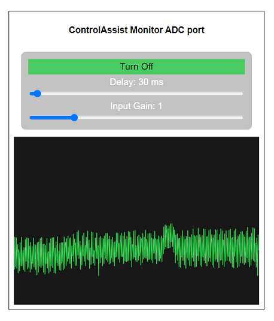
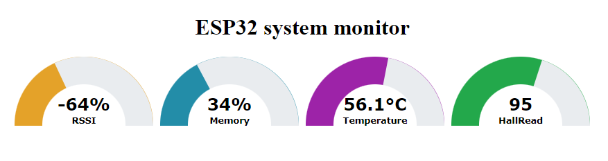

# ControlAssist
Multi-platform library for controlling html elements in a esp webpages at runtime using web sockets.

## Description
A library allowing linking **html elements** to **sketch variables** on pages hosted on **esp32/esp8266** devices. It uses a **web socket server** on the esp **device** and a JavaScript **web socket client** implementation on the web **page** allowing bi-directional real-time communication between **device** and **page**.

In a typical webpage, html **elements** like ``input box``, ``textbox``, ``range``, ``checkbox`` can be **binded** with ControlAssist internal variables using their unique **html ids** in order to associate their values. A **vectors** list will be generated to hold all associated element keys and their values.

## How it works
Every time an element is changing its value in the **web page**, a web socket message will be send to server and ControlAssist will update its internal value. Also if you change a ControlAssist value inside your sketch, a message will be automatically send to client and the value of the associated html element will be updated.

ControlAssist will automatically add JavaScript **onChange** handlers to the web page html code, so the binded elements will transmit their changes automatically to the server. It will also add JavaScript code to handle **incoming** web sockets messages so the values of the binded html elements can be updated.

ESP device will transmit **changes** to all connected **web socket** clients. This will make possible to have one ESP device and multiple Web pages opened from different places inside the network, receiving and sending changes.

## Features
* Automate **variables** and html **elements** in a typical ``ESP32/ESP8266`` project using web sockets communication.
* Automatic reconnects on wifi disconnections.
* Auto **synchronize** ESP32/ESP8266 internal **variables** with webpage elements.
* Automatically generate required **webpage scripts** to handle connections and changes.
* Support bi-directional hi-speed communications.
* Allow **mult-client** applications. (One esp, multiple pages)
* Support web sockets over **AP** connections.


<p align="center">
  
</p>

## How to use
Define yours internal page html code sections at Program mem.

```
PROGMEM const char HTML_HEADERS[] = R"=====(<!DOCTYPE HTML>)=====";
PROGMEM const char HTML_BODY[] = R"=====(<body></body>)=====";
PROGMEM const char HTML_FOOTER[] = R"=====(</htmll>)=====";
```
You can also upload page html code sections to spiffs as a html files

## ControlAssist init functions
Define and initialize you class
+ include the **ControlAssist**  class
  - `#include <ControlAssist.h>  //ControlAssist class`

+ Define your static instance
  - `ControlAssist ctrl;              //Default port 81 `
  - `ControlAssist ctrl(port);        //Use port `

+ in your setup you must initialize control class by setting your webpage html code.
  - `ctrl.setHtmlHeaders(HTML_HEADERS);`
  - `ctrl.setHtmlBody(HTML_BODY);`
  - `ctrl.setHtmlFooter(HTML_SCRIPT);`

+ You can also use spiffs for the html code. Upload the files contained in the /data folder to your spiffs and define the file names.
  - `#define HTML_HEADERS_FILENAME "/src/ESPVisualizer/ESP8266Wemos-VisH.html"`
  - `#define HTML_BODY_FILENAME "/src/ESPVisualizer/ESP8266Wemos-VisB.html"`
  - `#define HTML_SCRIPT_FILENAME "/src/ESPVisualizer/ESP8266Wemos-VisF.html"`

+ Set the files to be loaded when the page is requested.
  - `ctrl.setHtmlHeadersFile(HTML_HEADERS_FILENAME);`
  - `ctrl.setHtmlBodyFile(HTML_BODY_FILENAME);`
  - `ctrl.setHtmlFooterFile(HTML_SCRIPT_FILENAME);`

     See example <a href="examples/ControlAssist-ESPVisualizer">ControlAssist-ESPVisualizer</a>

+ in your setup you must bind the html elements you want to control.
  - `ctrl.bind("html_id");` to link the html element
  - `ctrl.bind("html_id", start_value );` if you need to bind and init for sending on connection
  - `ctrl.bind("html_id", start_value, changeFunction);` if you need also to handle changes

+ in your setup specify if you want to auto send key initial values during web socket connection.
  - `ctrl.setAutoSendOnCon("html_id",true /* send: enable/disable */);`
  - `ctrl.put("html_id", value);  // Set a default value to be send`

+ Configure web server to handle control assist page on a uri
  - ``` // Setup webserver
        server.on("/", []() {
          server.setContentLength(CONTENT_LENGTH_UNKNOWN);
          String res = "";
          res.reserve(CTRLASSIST_STREAM_CHUNKSIZE);
          while( ctrl.getHtmlChunk(res)){
            server.sendContent(res);
          }
        });
    ```

+ If you want to use a global callback function to handle key changes
  - `ctrl.setGlobalCallback(globalChangeFuncion);`


+ Start websockets server and listen for web socket client connections
  - `ctrl.begin();`


## ControlAssist control functions
Controlling your elements inside you loop function

+ Change the values of html elements. 

  - `ctrl.put("html_id", value,  /* forceSend: send even no change */, /* forceAdd: add key if not exists */ );`

+ Read current value of html element
  - `html_val = ctrl["html_id"]`

+ Handle changes inside your code with a handler function
  - `void globalChangeFuncion(uint8_t ndx){  String key = ctrl[ndx].key; int val = ctrl[ndx].val.toInt() }`

+ Inside your main loop() call ControlAssist loop() to handle web sockets server clients
  - `ctrl.loop();`

##### Note that when a html control is "binded" (linked to some backend variable), the library checks whether the new value in ctrl.put differs from the previous send or initial value. If there’s no change, ControlAssist by default does not resend the same value to conserve bandwidth. You can use ``forceSend`` in ctrl.put to send even if there is no change. This optimization is particularly important in applications where frequent updates could lead to performance bottlenecks or excessive network usage (e.g., sliders, real-time monitoring systems, or IoT dashboards).


## JavaScript handlers inside your webpage
A JavaScript event ``wsChange`` will be automatically send to each html element when the esp device changes it's value. You can add a JavaScript event listener on this event at your web page. So it will be possible to perform custom tasks when elements value is updated by web sockets.

```
html_id.addEventListener("wsChange", (event) => {
    //Get the changed value
    value = event.target.value
    event.preventDefault();
    return false;
});
```
See example ``ControlAssist-Gauge.ino``

<p align="center">
  
</p>

## Logging and debugging with log level
In you application you use **LOG_E**, **LOG_W**, **LOG_I**, **LOG_D** macros instead of **Serial.prinf** to print your messages. **ControlAssist** displays these messages with **timestamps**

You can define log level for each module
```
#define LOGGER_LOG_LEVEL 4
or
build_flags = -DLOGGER_LOG_LEVEL=5
```
```
#define _LOG_LEVEL_NONE      (0)
#define _LOG_LEVEL_ERROR     (1)
#define _LOG_LEVEL_WARN      (2)
#define _LOG_LEVEL_INFO      (3)
#define _LOG_LEVEL_DEBUG     (4)
#define _LOG_LEVEL_VERBOSE   (5)
```

## Compile
Download library files and place them on ./libraries directory under ArduinoProjects
Then include the **ControlAssist.h** in your application and compile..

+ Compile for arduino-esp32 or arduino-esp8266.
+ In order to compile you must install **WebSocketsServer** library.
+ Use compiler flags build_flags = -DCA_USE_LITTLEFS to use LITTLEFS instead of SPIFFS


###### If you get compilation errors on arduino-esp32 you need to update your arduino-esp32 library in the IDE using Boards Manager

